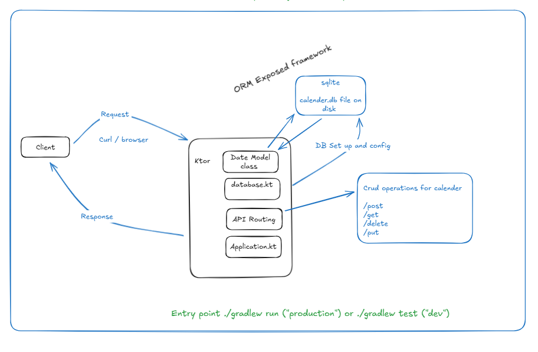

I need to build a minimal yet functional calendar API. 
The goal is to demonstrate your ability to design simple endpoints while connecting to and querying a database. 
We can run your own local DB or use a library like https://www.sqlite.org/.

The design I have in mind can be seen above image. 

please build on the existing code to deliver this functionality.
A convenience script exists for testing in test_app.sh, 
this can be used to validate existing functionality and it should be extended as new functionality is added.

ensure you tackle problems in small chunks i.e implementation one new rest end point at a time and ensuring that 
is working before proceeding.

when executing test_app.sh you can check the contents of @./app.log file which may contain errors from start up if it 
seems the responses are not returning data in the expected time.  